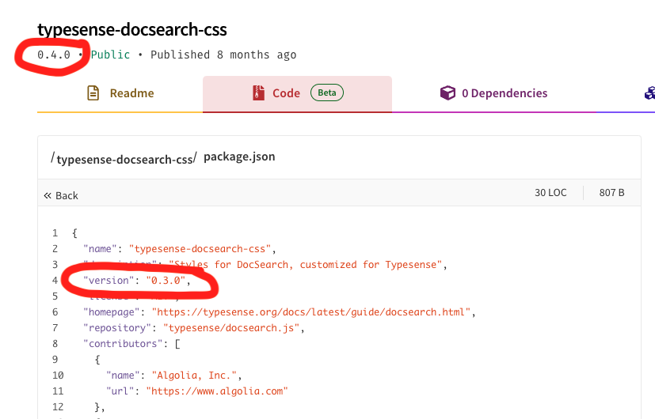

# Issue with installation of typesense-docsearch-css@0.4.0

This repository reproduces an [issue with the installation of `typesense-docsearch-css@0.4.0` when using Pnpm cache](https://github.com/typesense/typesense-docsearch.js/issues/12).

## Table of contents

* [Context](#context)
* [Versions](#versions)
* [Expected behavior](#expected-behavior)
* [Actual behavior](#actual-behavior)
* [How to reproduce the issue](#how-to-reproduce-the-issue)
* [Possible cause](#possible-cause)
* [Impact on other packages](#impact-on-other-packages)
* [Solution](#solution)

## Context

The repository contains:

* A `package.json` file with a dependency on the `typesense-docsearch-css@0.4.0` package.
* A github workflow that installs the repository dependencies, with Pnpm cache enabled.

## Versions

* typesense-docsearch-css: 0.4.0
* Node.js: 18.x
* Pnpm: 8.6.0
* Workflow runner: `ubuntu-latest`

## Expected behavior

The installation of the NPM dependencies should succeed every time the workflow is run.

## Actual behavior

The first time the workflow is run, the installation of the dependencies succeeds. __The second time the workflow is run, [the installation of the `typesense-docsearch-css` package fails](https://github.com/javierbrea/typesense-docsearch-css-issue/actions/runs/6689006668/job/18171899929) with the following error__:

```txt
ERR_PNPM_UNEXPECTED_PKG_CONTENT_IN_STORE
Package name mismatch found while reading {"integrity":"sha512-hVTJC1Rg2BnNB4kl2Qi4GcgjFmPZY8YGu0aJ5V6iM6vK62yvtE7jObnAc1maYOp33NWFVLPgl/9PlBfWBlN0Dw==","registry":"https://registry.npmjs.org/","tarball":"https://registry.npmjs.org/typesense-docsearch-css/-/typesense-docsearch-css-0.4.0.tgz"} from the store.
This means that the lockfile is broken.
Expected package: typesense-docsearch-css@0.4.0.
Actual package in the store by the given integrity: typesense-docsearch-css@0.3.0.
Error: Process completed with exit code 1.
```

## How to reproduce the issue

1. Fork this repository
2. Create a branch from the `main` branch
2. Push the branch to run the workflow
3. Run the workflow again

## Possible cause

The issue seems to be related to the fact that the [`typesense-docsearch-css@0.4.0` package](https://www.npmjs.com/package/typesense-docsearch-css/v/0.4.0?activeTab=code) was published with the same version number as a previous version of the package.



## Impact on other packages

The issue also affects the following upstream packages:

* `typesense-docsearch.js@3.4.0`
* `docusaurus-theme-search-typesense@0.13.0`
* `typesense-docsearch-react@3.4.0`

## Solution

A new version of the `typesense-docsearch-css` package has been published. The issue is not reproducible anymore when using the `typesense-docsearch-css@0.4.1` package.

This can be checked by running the build workflow in the `test/update-dependency` branch more than once. The workflow will run successfully every time.

New versions of the upstream packages have also been published:

* `typesense-docsearch.js@3.4.1` - Checked in branch `test/typesense-docsearch.js`
* `docusaurus-theme-search-typesense@0.13.1` - Checked in branch `test/docusaurus-theme-search-typesense`
* `typesense-docsearch-react@3.4.1` - Checked in branch `test/typesense-docsearch-react`
